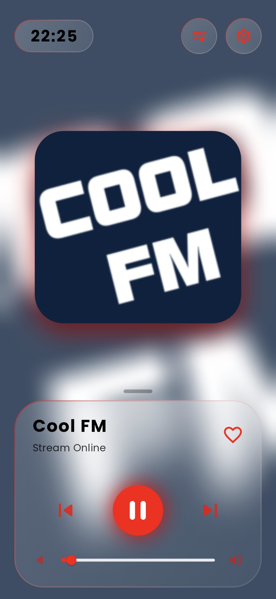
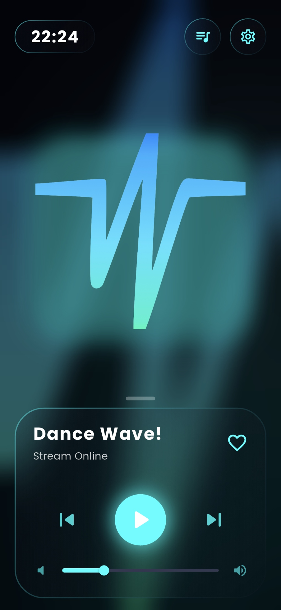
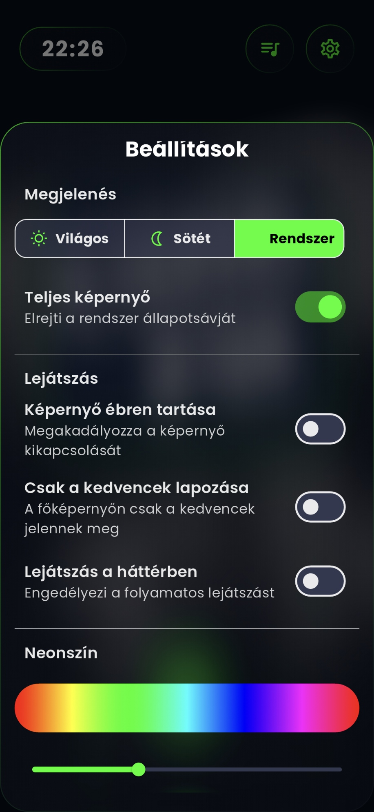

  

# Radiont

**Egy modern, letisztult és testreszabható internetes rádiólejátszó alkalmazás, amely a zenehallgatás élményét helyezi a középpontba.**

## 📖 Leírás

A Radiont egy Flutter keretrendszerrel készült mobilalkalmazás, amely lehetővé teszi a felhasználók számára, hogy egyszerűen böngészhessenek és hallgathassanak magyarországi online rádióállomásokat. Az alkalmazás egy látványos, "glassmorphism" stílusú felhasználói felülettel rendelkezik, amely dinamikusan változó hátterekkel és neonfény-effektekkel teremt egyedi vizuális élményt.

Architekturálisan az alkalmazás a **Provider** state management megoldásra épül, amely egy tiszta és skálázható kódbázist biztosít a `ThemeProvider` és a `RadioProvider` szétválasztásával. A zenelejátszást a nagy teljesítményű `just_audio` csomag kezeli, míg a beállítások perzisztens tárolása a `shared_preferences` segítségével történik. Az állomások listáját a [Radio Browser API](https://www.radio-browser.info/) szolgáltatja.

---

## ✨ Funkciók

- **🎧 Online Rádió Streaming**: Hallgass több tucat magyar rádióállomást élőben.
- **🎨 Testreszabható Megjelenés**:
    - Világos, Sötét és Rendszer-alapú téma.
    - Dinamikusan választható **neonszín**, amely az egész alkalmazás megjelenését meghatározza.
    - Teljes képernyős mód az állapotsáv elrejtéséhez.
- **💖 Kedvencek Rendszer**: Mentsd el kedvenc állomásaidat a gyors elérés érdekében, és szűrj a lejátszási listában csak a kedvencekre.
- ** sleek UI & Animations**:
    - Modern **Glassmorphism** dizájn áttetsző felületekkel.
    - Finom, folyamatos animációk minden interakciónál.
    - Dinamikusan generált, animált háttér, amely a választott neonszínhez igazodik.
- **▶️ Fejlett Lejátszó Vezérlők**:
    - Lejátszás, szünet, előző/következő állomás.
    - Rendszerszintű hangerőszabályzó közvetlenül az alkalmazásból.
- **⚙️ Kényelmi Funkciók**:
    - Keresés az összes elérhető állomás között.
    - Opció a képernyő ébren tartására zenehallgatás közben (`wakelock`).
    - Lehetőség a háttérben történő lejátszásra (megfelelő engedélyekkel).

---
# ❗ Új funkciók:
  - Mostantól a rádióállomások között válthatunk közvetlenül az értesítési sávról és a lezárt képernyőről is.
  - Irányítsd a zenehallgatást anélkül, hogy a telefonodhoz érnél – mostantól a kormánygombokkal vagy a fülhallgatóddal is válthatsz csatornát
  
  ---

## 📸 Képernyőképek

| Világos Téma | Sötét Téma | Beállítások |
| :---: |:---:|:---:|
|  |  |  |

---

## 🚀 Legutóbbi Kiadás (v1.2.5)

A legfrissebb stabil kiadás már elérhető! Ez a verzió tartalmazza az összes fent említett funkciót, stabilitási javításokat és egy teljesen megújult felhasználói élményt.

A teljes kiadási jegyzékért és a telepítőfájlok letöltéséért kattints az alábbi gombra:

